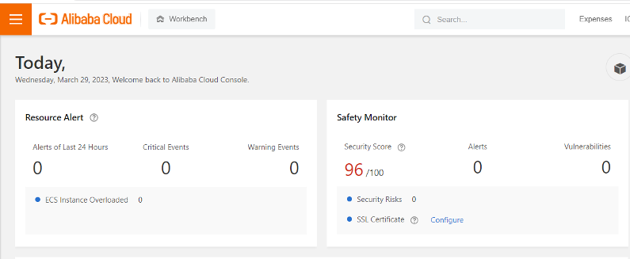
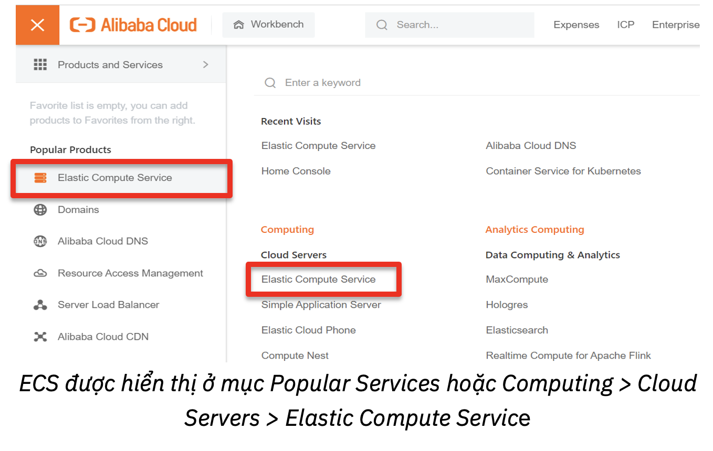
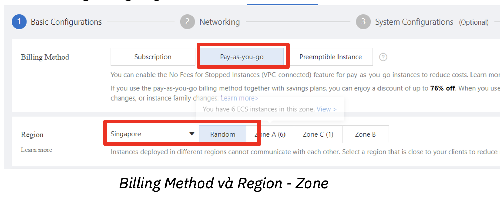
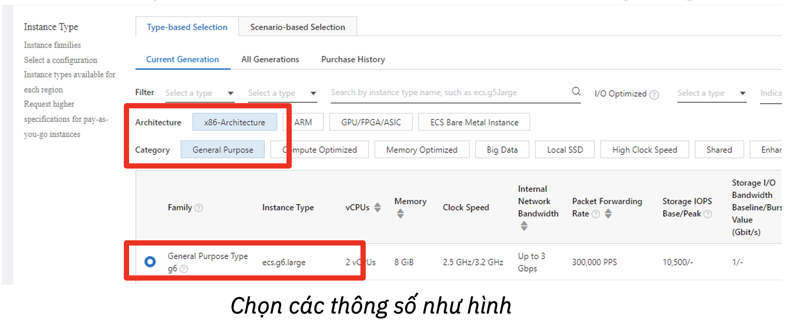
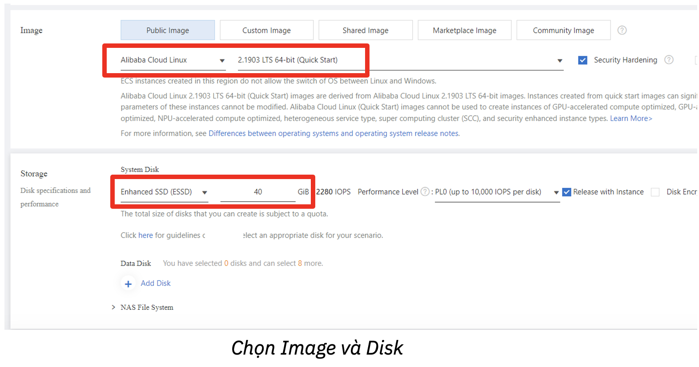
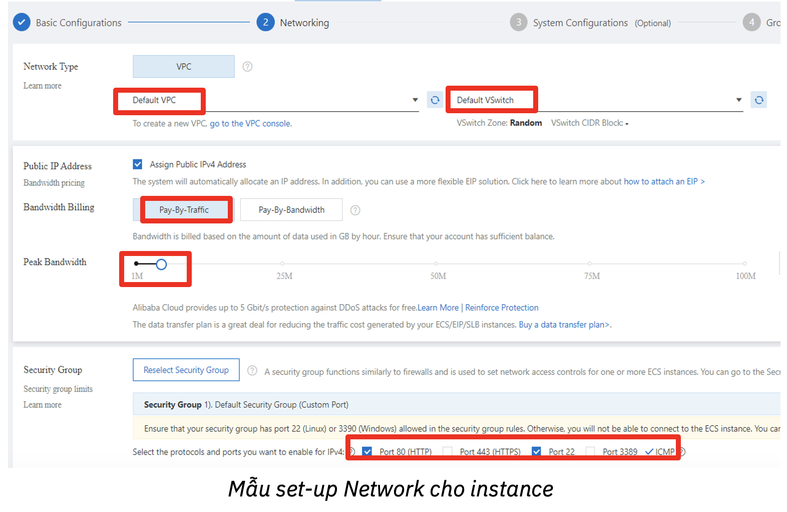

### Elastic Compute Service là gì?
**Elastic Compute Service (ECS)** là một sản phẩm của **Alibaba Cloud** cung cấp các máy ảo vận hành trên đám mây.

Để bắt đầu sử dụng ECS, bạn có thể một máy ảo (ECS instance) từ giao diện **Console** của Alibaba Cloud.

### Các bước tạo máy ảo ECS

Đầu tiên, để tạo một máy ảo trên ECS, bạn cần có một tài khoản **Alibaba Cloud** và đăng nhập vào tài khoản.

Sau khi đăng nhập thành công, từ giao diện console của Alibaba Cloud, chọn vào menu ở góc trái, chọn **Elastic Compute Service**.

Sau đó chọn **Create Instance** trong phần **My Resources**.

Sau khi chọn **Create Instance**, chọn **Custom Launch** để có thể xem được tất cả các thông số của máy ảo mới. Để tạo một máy ảo, ta sẽ đi qua 5 giai đoạn:

- Basic Configuration (các thông số cơ bản)
- Networking (thông tin về mạng)
- System Configurations (thông số hệ thống) - không bắt buộc
- Grouping (chọn nhóm bảo mật cho máy ảo) - không bắt buộc
- Preview (xem lại các thông số chi tiết đã lựa chọn cho máy ảo).

### Giai đoạn 1: Set-up các thông số cơ bản (Basic Configurations)

- Billing Method: Alibaba Cloud cung cấp ba phương thức chính để thanh toán đối với máy ảo ECS:
- Subscription (trả trước theo tháng/năm);
- Pay-as-you-go (trả theo số lượng tài nguyên bạn sử dụng trên máy ảo)
- Ở đây, chúng ta chọn Pay-as-you-go.

**Region và Zone:**

- Region là khu vực của data center mà máy ảo của bạn sẽ được deploy, nên chọn khu vực ở gần nhất để đạt được hiệu suất truy cập ổn định. Bạn có thể Region là Singapore.
- Zone là vùng tương ứng với mỗi khu vực, chọn Random.

**Instance Type:** loại máy ảo mà bạn chọn sử dụng.

- Alibaba Cloud hỗ trợ nhiều loại kiến trúc (architecture) và loại máy ảo (category) khác nhau. Chọn kiến trúc x86, loại ecs.g6.large.

**Quantity:** số lượng instance, để mặc định là 1.
**Image:** hệ điều hành và các dịch vụ (nếu có) chạy cho máy ảo. Alibaba Cloud cung cấp nhiều hình thức để lựa chọn image:

- Trong bài hướng dẫn này, ta sẽ sử dụng Public Image là các hệ điều hành được cung cấp bởi Alibaba và các nhà phát hành hệ điều hành khác, chọn Public Image > Alibaba Cloud Linux > 2.1903 LTS 64-bit.

**Storage:** Elastics Block Storage dùng cho ECS Instance. Chọn **Enhanced SSD (ESSD)** với 40 GiB.

Sau khi chọn xong, chọn **Next** ở cuối trang.

### Giai đoạn 2: Set-up thông tin về mạng (Network)

**Network Type** - mặc định là VPC: giữ nguyên ở Default VPC và Default VSwitch.

**Public IP Address:** tick vào mục Assign Public IPv4 Address. Sau đó chọn:

- Pay-by-Traffic (trong chế độ Pay-By-Traffic, phí được tính dựa trên lượng dữ liệu được truyền vào)
- Peak Bandwidth: 200 Mbps

**Security Group**: Chọn Security Group có sẵn hoặc các port được cho phép truy cập cho instance của bạn. Chọn các port mà bạn muốn, một số port:

- Port 80 là cổng mặc định được sử dụng cho các dịch vụ web.
- Port 22 được sử dụng để đăng nhập vào các phiên bản Linux ECS.
- Port 3389 được sử dụng để đăng nhập vào Remote Desktop trên Windows.

Hoàn tất set-up **Network**, chọn **Next**.

### Giai đoạn 3: Set-up các thông số hệ thống (System Configurations)

Tại phần này, hai thông tin cần quan tâm nhất là **Log-on Credential** và **Instance Name**.

- **Log-on Credential**: thông tin để kết nối vào instance. Bạn có thể chọn Password để cài đặt password cho instance, hoặc chọn Set Later nếu chưa cần cài ngay.
- **Instance Name:** đặt tên cho Instance, nếu không điền bước này. Tên của ECS Instance sẽ được đặt tự động.
- Nhấn **Next** để chuyển sang phần tiếp theo.

### Giai đoạn 4: Nhóm (grouping)

Giữ bước này ở mặc định và chọn **Next**.

### Giai đoạn 5: Review và hoàn tất

Xem lại tất cả các thông tin của instance sắp được tạo, cùng với giá tiền bạn phải trả tại tab **Preview**. Sau đó tại mục E**CS Terms and Service**, tick để đồng ý với điều khoản sử dụng, sau đó nhấn **Create Instance** để tiến hành tạo máy ảo.

**Popup** xác nhận như bên dưới sẽ hiện lên, nhấn **Console** để hoàn tất và di chuyển để tab **Instances**.

Sau khi nhấn **Console**, **Instance** được tạo thành công sẽ có trạng thái **Running**!

Chúc mừng bạn đã tạo thành công máy ảo trong ECS! Để thực hiện các thao tác liên quan với instance, nhấn vào các tên thao tác trong mục **Actions** được hiển thị cùng dòng với thông tin máy ảo.

*By Vo Thi Phuong Anh, Alibaba Cloud Solutions Architect of Vietnam*
#### Tham khảo https://www.alibabacloud.com/blog/600134