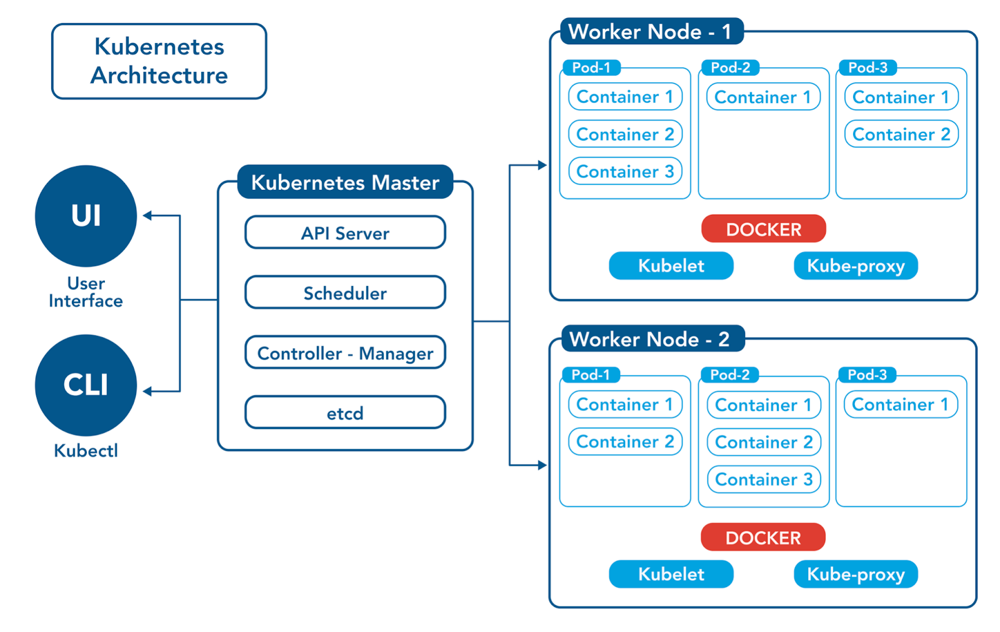

# Kubernetes là gì ?
**Kubernetes** là một nền tảng mã nguồn mở, được quản lý bởi cộng đồng, để tự động hóa việc triển khai, cân bằng tải và quản lý các ứng dụng được đóng gói trong các **container**. **Kubernetes** thường được gọi là bộ điều phối **container**, vì nó có nhiệm vụ tự động hóa các tác vụ thủ công liên quan đến việc triển khai và quản lý các ứng dụng **container**.

**Kubernetes** được sử dụng bởi một số công ty lớn, bao gồm **Alibaba Cloud**, **Google**, A**mazon Web Services** và **Microsoft**. Nó cũng được sử dụng bởi một số công ty khởi nghiệp và doanh nghiệp nhỏ.

**Kubernetes** có thể được sử dụng để thực hiện một số nhiệm vụ **DevOps**, bao gồm:

- **Triển khai ứng dụng**: Kubernetes có thể được sử dụng để triển khai các ứng dụng container hóa một cách nhanh chóng và dễ dàng. Điều này có thể giúp đảm bảo rằng các ứng dụng luôn được triển khai một cách nhất quán và đáng tin cậy.
- **Quản lý ứng dụng**: Kubernetes có thể được sử dụng để quản lý các ứng dụng container hóa, bao gồm việc giám sát hiệu suất, theo dõi tài nguyên và cân bằng tải. Điều này có thể giúp đảm bảo rằng các ứng dụng luôn hoạt động tốt và đáp ứng nhu cầu của người dùng.
- **Tự động hóa**: Kubernetes có thể được sử dụng để tự động hóa nhiều nhiệm vụ liên quan đến vận hành, chẳng hạn như triển khai bản cập nhật, quản lý lưu lượng truy cập và theo dõi hiệu suất. Điều này có thể giúp giảm bớt gánh nặng cho các nhóm vận hành và cho phép họ tập trung vào các nhiệm vụ chiến lược hơn.

Dưới đây là một số lợi ích của việc sử dụng Kubernetes:

- **Tự động hóa**: Kubernetes có thể tự động hóa các tác vụ như triển khai, quản lý và mở rộng các ứng dụng container hóa. Điều này có thể giúp bạn tiết kiệm thời gian và công sức.
- **Khả mở rộng**: Kubernetes có thể dễ dàng mở rộng để đáp ứng nhu cầu của các ứng dụng của bạn. Điều này có thể giúp bạn đảm bảo rằng các ứng dụng của bạn luôn có sẵn và đáp ứng nhu cầu của người dùng.
- **Tính tin cậy**: Kubernetes có thể giúp bạn đảm bảo rằng các ứng dụng của bạn luôn tin cậy. Điều này có thể được thực hiện thông qua các tính năng như tự phục hồi, cân bằng tải và giám sát.
- **Tính linh hoạt**: Kubernetes có thể được sử dụng để chạy các loại ứng dụng khác nhau. Điều này có thể giúp bạn linh hoạt hơn trong việc lựa chọn các ứng dụng để sử dụng.

Nếu bạn đang tìm kiếm một hệ thống để quản lý các ứng dụng container hóa, Kubernetes là một công cụ đáng để xem xét.

**Tham khảo**
- [Trang chủ Kubernetes](https://kubernetes.io/vi/)
- [Kubernetes CheatSheet](KUBERNETES-Cheat-Sheet.pdf)