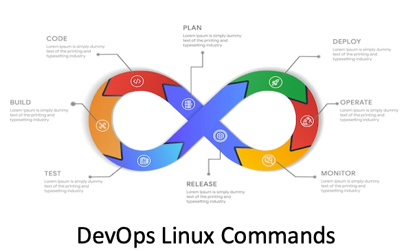

**DevOps** là một phương pháp tiếp cận tích hợp và tự động hóa các quy trình phát triển và vận hành phần mềm. Mục tiêu của DevOps là cung cấp phần mềm nhanh hơn, đáng tin cậy hơn và linh hoạt hơn.

**Linux** là một hệ điều hành mã nguồn mở, đa năng được sử dụng rộng rãi trên các máy chủ, máy tính để bàn và thiết bị di động. Linux là một nền tảng phổ biến cho DevOps vì nó miễn phí, linh hoạt và có thể được tùy chỉnh để đáp ứng các nhu cầu cụ thể của một tổ chức.

Có một số lợi ích của việc sử dụng Linux cho DevOps, bao gồm:

- **Miễn phí**: Linux là một hệ điều hành mã nguồn mở, có nghĩa là nó miễn phí để sử dụng và phân phối. Điều này có thể giúp tiết kiệm chi phí cho các tổ chức.
- L**inh hoạt**: Linux là một hệ điều hành rất linh hoạt và có thể được tùy chỉnh để đáp ứng các nhu cầu cụ thể của một tổ chức. Điều này có thể giúp các tổ chức xây dựng và vận hành phần mềm một cách hiệu quả hơn.
- **Hỗ trợ tốt**: Linux có một cộng đồng người dùng và nhà phát triển lớn, cung cấp hỗ trợ tốt cho các tổ chức sử dụng hệ điều hành này.

Nếu bạn đang tìm kiếm một nền tảng cho DevOps, Linux là một lựa chọn tốt. Linux là một hệ điều hành miễn phí, linh hoạt và có hỗ trợ tốt, có thể giúp các tổ chức xây dựng và vận hành phần mềm một cách hiệu quả hơn.

Dưới đây là một số ví dụ về cách Linux được sử dụng cho DevOps:

- Tự động hóa các quy trình phát triển và vận hành: Linux có thể được sử dụng để tự động hóa các quy trình phát triển và vận hành, chẳng hạn như xây dựng, kiểm tra và triển khai mã.
- Quản lý cơ sở hạ tầng: Linux có thể được sử dụng để quản lý cơ sở hạ tầng, chẳng hạn như máy chủ, mạng và lưu trữ.
- Bảo mật: Linux có thể được sử dụng để bảo vệ phần mềm và cơ sở hạ tầng, chẳng hạn như bằng cách sử dụng tường lửa, mã hóa và kiểm tra bảo mật.
- Giám sát: Linux có thể được sử dụng để giám sát phần mềm và cơ sở hạ tầng, chẳng hạn như bằng cách sử dụng công cụ giám sát và cảnh báo.

DevOps và Linux là hai công nghệ có thể được kết hợp để tạo ra một môi trường phát triển và vận hành hiệu quả hơn. Linux có thể được sử dụng để tự động hóa các quy trình phát triển và vận hành, quản lý cơ sở hạ tầng, bảo vệ phần mềm và cơ sở hạ tầng, và giám sát phần mềm và cơ sở hạ tầng. Bằng cách kết hợp DevOps và Linux, các tổ chức có thể xây dựng và vận hành phần mềm một cách nhanh hơn, đáng tin cậy hơn và linh hoạt hơn.

**Tham khảo**
- https://www.linux.org/
- https://www.amazon.com/Hands-DevOps-Linux-Pipelines-Kubernetes/dp/9389423481/
- https://www.amazon.com/Practical-Linux-DevOps-Building-Development/dp/1484283171