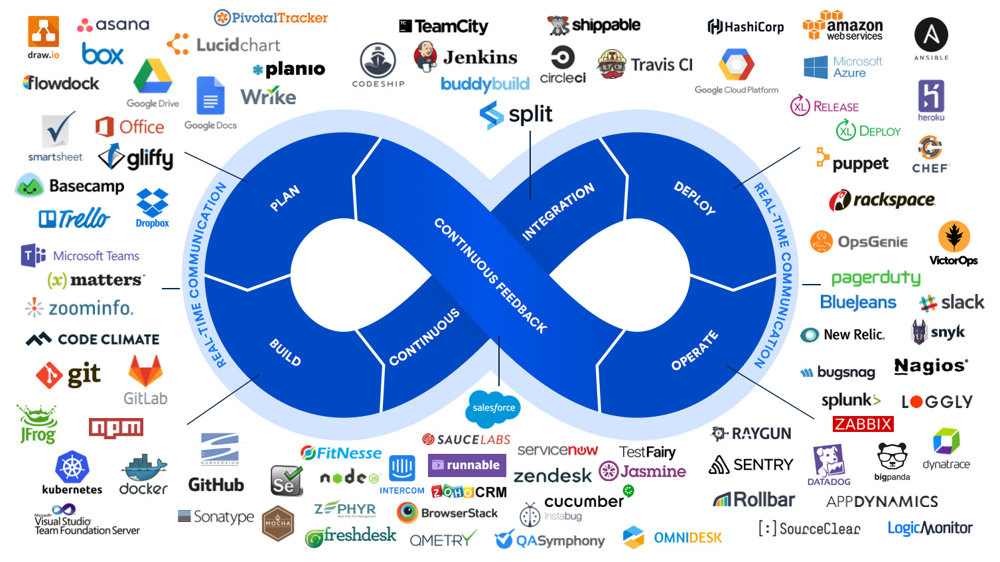
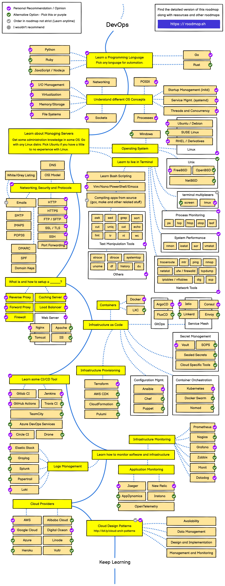
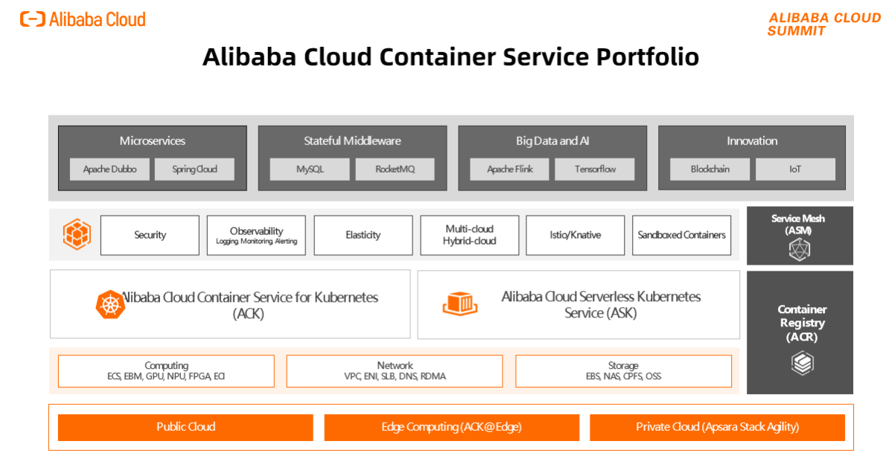

# DevOps là gì ?

**DevOps** là sự kết hợp của từ **Development** (phát triển tính năng sản phẩm) + **Operations** (vận hành) . **DevOps** là một sự kết hợp của các nguyên lý, thực hành, quy trình và các tool giúp tự động hóa quá trình lập trình và chuyển giao phần mềm . **DevOps** là một thuật ngữ để chỉ một tập hợp các hành động trong đó nhấn mạnh sự hợp tác và trao đổi thông tin của các lập trình viên và chuyên viên tin học khi cùng làm việc để tự động hóa quá trình chuyển giao sản phẩm phần mềm và thay đổi kiến trúc hệ thống.

**DevOps** là một phương pháp quản lý và phát triển phần mềm mới so với các cách tiếp cận truyền thống của quản lý dự án. DevOps thay đổi cách tiếp cận truyền thống là phát triển và thử nghiệm riêng biệt. Các nhóm hoạt động theo cách hợp tác trong đó cả hai nhóm đều tích cực tham gia trong suốt vòng đời dịch vụ. **DevOps** sẽ giúp tối ưu hóa 2 giai đoạn phát triển phần mềm này giúp đẩy cao tốc độ phát triển và cải tiến sản phẩm so với các quy trình quản lý và phát triển phần mềm truyền thống

### Các giai đoạn trong vòng đời DevOps

Có 7 giai đoạn trong vòng đời **DevOps**:

- **Phát triển liên tục (CD)** – Continuous development
- **Tích hợp liên tục (CI)** – Continuous integration
- **Kiểm tra liên tục** – Continuous testing
- **Triển khai liên tục** – Continuous Deployment
- **Phản hồi liên tục** – Continuous Feedback
- **Giám sát liên tục** – Continuous Monitoring
- **Hoạt động liên tục** – Continuous Operations

### Lợi ích của DevOps

Các lợi ích của **DevOps** bao gồm:

- Tăng tốc độ triển khai sản phẩm
- Giảm thiểu thời gian phát triển sản phẩm
- Tăng khả năng phục hồi sau khi có sự cố
- Tăng tính linh hoạt và khả năng thích nghi với thay đổi
- Tăng sự hợp tác giữa các nhóm phát triển và vận hành
- Giảm thiểu rủi ro và chi phí

### Một số công cụ sử dụng cho DevOps

Một số công cụ **DevOps** thông dụng được biết đến bao gồm :

- **Git & GitHub** – Quản lý mã nguồn (Hệ thống kiểm soát phiên bản)
- **Jenkins** – Máy chủ tự động, với các plugin được xây dựng để phát triển **CI / CD pipelines**
- **Selenium** – Kiểm thử tự động
- **Docker** – Container hóa phần mềm
- **Kubernetes** – Công cụ điều phối container
- **Puppet** – Quản lý cấu hình và triển khai
- **Terraform** - Đơn giản hóa việc khởi tạo và quản lý tài nguyên  

### Kỹ năng để trở thành DevOps

Các kỹ năng cần thiết để trở thành **DevOps** bao gồm :

- Kiến thức về các công cụ và phần mềm liên quan đến DevOps
- Kiến thức về các quy trình phát triển phần mềm
- Kỹ năng lập trình
- Kỹ năng quản lý dự án
- Kỹ năng giao tiếp và hợp tác

## DevOps - Những câu chuyện thực tế

Lúc đầu, **DevOps** được cho là không thực tế với nhiều người do thiếu môi trường và các điều kiện như **Netflix** hay các công ty trong **Fortune 500** đang có. Nhưng giờ đây, tất cả các các doanh nghiệp đang tìm cách áp dụng các phương pháp DevOps, nó đang trở thành chuẩn mực.

Bạn sẽ thấy từ các tài liệu tham khảo bên dưới rằng có rất nhiều ngành và ngành dọc khác nhau đang sử dụng **DevOps** và nó có tác động tích cực đến các mục tiêu kinh doanh của họ.

Lợi ích bao trùm ở đây là nếu **DevOps** được thực hiện đúng cách, tốc độ và chất lượng phát triển phần mềm của doanh nghiệp sẽ được cải thiện.

Hôm nay, chúng ta sẽ xem xét các công ty thành công đã áp dụng phương pháp **DevOps** và chia sẻ câu chuyện thực tế của họ. Đây cũng là cơ hội tuyệt vời để cộng đồng tham gia. Bạn đã áp dụng văn hóa **DevOps** trong doanh nghiệp của mình chưa? Nó có thành công không?

Chúng ta đã đề cập đến **Netflix** và sẽ đề cập đến nó một lần nữa vì đây là một mô hình rất tốt và khá tiên tiến so với những gì chúng ta thường thấy ngày nay và cũng sẽ đề cập đến một số doanh nghiệp lớn khác đã và đang thành công khi áp dụng các phương pháp, văn hoá **DevOps**.

### Amazon

Năm **2010**, **Amazon** đã chuyển từ các máy chủ vật lý sang sử dụng điện toán đám mây **AWS** (**Amazon Web Services**). Điều này cho phép họ tiết kiệm tài nguyên bằng cách tăng/giảm dung lượng theo từng bước rất nhỏ. Chúng ta cũng biết rằng trong nhiều năm trở lại đây, **AWS** đã phát triển và tạo ra doanh thu khổng lồ cho **Amazon**.

Vào năm **2011** (theo video ở phía dưới), **Amazon** đã áp dụng một quy trình triển khai liên tục cho phép nhóm phát triển có thể triển khai mã bất cứ khi nào họ muốn tới bất cứ máy chủ nào họ cần. Điều này cho phép **Amazon** triển khai phần mềm mới cho các máy chủ sản xuất với thời gian trung bình là 11.6 giây!

### Netflix

Ai sẽ không sử dụng **Netflix**? Đây rõ ràng là một dịch vụ phát trực tuyến khổng lồ với chất lượng cao, mang lại trải nghiệm người dùng tuyệt vời, ít nhất là đối với cá nhân tôi.

Tại sao trải nghiệm người dùng **Netflix** lại tuyệt vời như vậy? Khả năng cung cấp dịch vụ mà không gặp một lỗi nào đáng kể đòi hỏi tốc độ, sự linh hoạt và chú ý đến chất lượng.

Nhóm phát triển tại **Netflix** có thể tự động xây dựng các đoạn mã thành các **web images** có thể được triển khai mà không cần phụ thuộc vào đội vận hành. Khi các **images** được cập nhật, chúng được tích hợp vào cơ sở hạ tầng của **Netflix** bằng cách bằng cách sử dụng nền tảng web được tùy biến.

Giám sát liên tục đảm bảo rằng nếu việc triển khai **images** không thành công, phiên bản trước đó sẽ được sử dụng và các truy cập sẽ được định tuyến lại đến phiên bản cũ đó.

Dưới đây là một cuộc nói chuyện tuyệt vời về những điều "*nên làm*" và "*không nên làm*" mà **Netflix** thực hành trong nhóm.

### Etsy

Nhiều người trong chúng ta và nhiều doanh nghiệp đã thực sự phải vật lộn với việc triển khai chậm chạp và khó khăn. Tương tự với điều đó, chúng ta có thể đã có kinh nghiệm làm việc trong các nhóm phối hợp kém với nhau.

Với những gì đã đọc từ **Amazon** và **Netflix**, **Etsy** có thể đã cho phép nhóm phát triển tự triển khai mã nguồn của họ vào khoảng cuối năm **2009**, thậm chí còn có thể trước hai doanh nghiệp lớn trên. (Thật không thể tin được!)

Một điều thú vị khác mà tôi rút ra được ở đây là khi các nhà phát triển cảm thấy có trách nhiệm với việc triển khai, họ cũng sẽ chịu trách nhiệm với hiệu suất ứng dụng, uptime và các mục tiêu, chỉ số khác.

Văn hóa học hỏi là một phần quan trọng của **DevOps**, và ngay cả thất bại cũng có thể trở thành thành công nếu chúng ta rút ra được các bài học từ đó. (Tôi không biết câu trích dẫn này thực sự đến từ đâu, nhưng nó có vẻ rất đúng!).

Chúng ta cũng sẽ có thêm một số câu chuyện khác về cách **DevOps** giúp thay đổi các doanh nghiệp rất thành công.

## Tóm tắt 

Qua những bài viết, chúng ta có thể tóm tắt về **DevOps** như sau

- **DevOps** là sự kết hợp giữa Phát triển (**Dev**) và Vận hành (**Ops**) cho phép một nhóm duy nhất quản lý toàn bộ vòng đời phát triển ứng dụng bao gồm Phát triển, Kiểm thử, Triển khai, Vận hành.
- Trọng tâm và mục đích chính của **DevOps** là rút ngắn vòng đời phát triển trong khi thường xuyên cung cấp các tính năng, bản sửa lỗi, chức năng phù hợp và liên quan chặt chẽ tới mục tiêu kinh doanh.
- **DevOps** là một cách tiếp cận cho quá trình phát triển phần mềm, qua đó phần mềm có thể được phân phối và phát triển một cách đáng tin cậy và nhanh chóng. Đôi khi còn được nhắc tới với các khái niệm như Phát triển, Kiểm thử, Triển khai, Giám sát (liên tục).

## Roadmap để trở  thành DevOps

**Alibaba Cloud Container Service Portfolio**

## Tham khảo

- https://vi.wikipedia.org/wiki/DevOps
- https://roadmap.sh/devops
- https://www.alibabacloud.com/product/kubernetes
- https://www.alibabacloud.com/product/kubernetes/distro
- https://www.alibabacloud.com/product/container-registry
- https://www.alibabacloud.com/product/ack-one
- https://www.alibabacloud.com/product/elastic-container-instance
- https://www.alibabacloud.com/solutions/container/devops
- https://vn.alibabacloud.com/vi/solutions/devops
- https://edu.alibabacloud.com/certification/specialty-devops
- https://landscape.cncf.io/members?selected=alibaba-cloud-member
- https://opencontainers.org/
- https://oam.dev/
- https://kubernetes.io/vi/partners/#kcsp
- [DevOps in 5 Minutes](https://www.youtube.com/watch?v=Xrgk023l4lI)
- [What is DevOps? Easy Way](https://www.youtube.com/watch?v=_Gpe1Zn-1fE&t=43s)
- [DevOps roadmap 2022 | Success Roadmap 2022](https://www.youtube.com/watch?v=7l_n97Mt0ko)
- [What is DevOps? - TechWorld with Nana](https://www.youtube.com/watch?v=0yWAtQ6wYNM)
- [What is DevOps? - GitHub YouTube](https://www.youtube.com/watch?v=kBV8gPVZNEE)
- [What is DevOps? - IBM YouTube](https://www.youtube.com/watch?v=UbtB4sMaaNM)
- [What is DevOps? - AWS](https://aws.amazon.com/devops/what-is-devops/)
- [What is DevOps? - Microsoft](https://docs.microsoft.com/en-us/devops/what-is-devops)
- [How Netflix Thinks of DevOps](https://www.youtube.com/watch?v=UTKIT6STSVM)
- [16 Popular DevOps Use Cases & Real Life Applications [2021]](https://www.upgrad.com/blog/devops-use-cases-applications/)
- [DevOps: The Amazon Story](https://www.youtube.com/watch?v=ZzLa0YEbGIY)
- [How Etsy makes DevOps work](https://www.networkworld.com/article/2886672/how-etsy-makes-devops-work.html)
- [Adopting DevOps @ Scale Lessons learned at Hertz, Kaiser Permanente and lBM](https://www.youtube.com/watch?v=gm18-gcgXRY)
- [Interplanetary DevOps at NASA JPL](https://www.usenix.org/conference/lisa16/technical-sessions/presentation/isla)
- [Target CIO explains how DevOps took root inside the retail giant](https://enterprisersproject.com/article/2017/1/target-cio-explains-how-devops-took-root-inside-retail-giant)