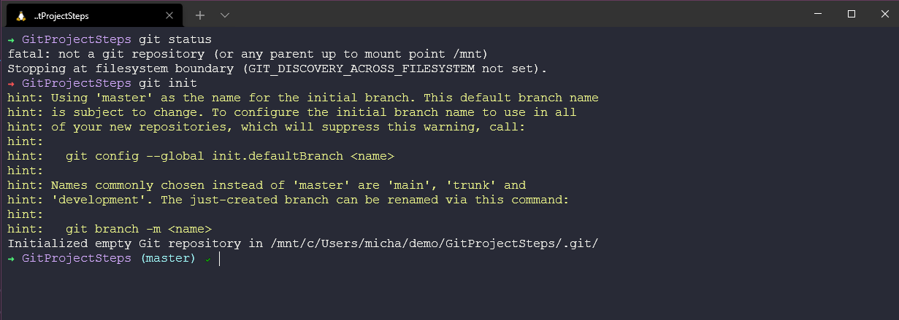
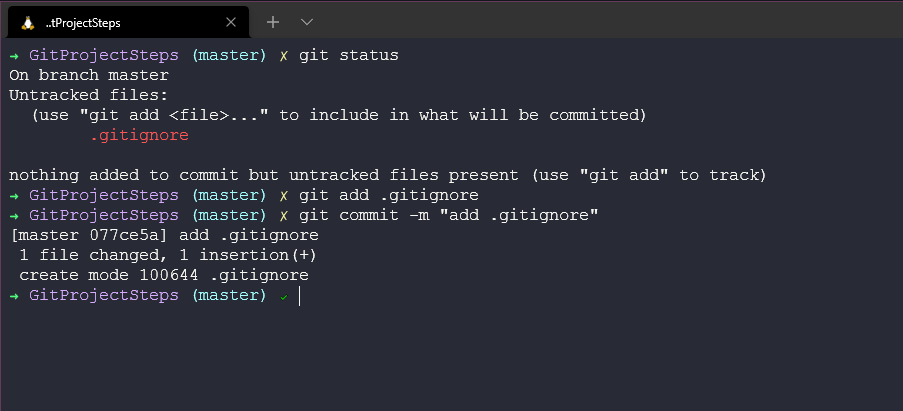

## Staging & Changing

Chúng ta đã đề cập đến một số điều cơ bản nhưng việc đưa mọi thứ vào một kịch bản hoàn chỉnh giúp tôi học và hiểu cách thức, lý do chúng ta thực hiện theo cách này tốt hơn. Trước khi chúng ta sử dụng bất kỳ dịch vụ dựa trên git nào như **GitHub**, git có các chức năng mà bạn có thể tận dụng trên máy của mình.

Chúng ta sẽ lấy thư mục dự án mà chúng ta đã tạo ở bài đầu tiên về git và đi qua lần lượt các bước với git. Chúng ta tạo một thư mục trên máy của mình và khởi tạo git với lệnh `git init`.

Chúng ta cũng có thể thấy rằng thư mục đã được khởi tạo có một thư mục ẩn.

Đây là nơi lưu trữ thông tin chi tết về **git repository** cũng như thông tin liên quan đến các nhánh và **commit** của chúng ta.

### Stage các file

Chúng ta bắt đầu làm việc với thư mục rỗng hoặc có thể chúng ta có một số mã nguồn vào những ngày trước đó. Đầu tiên, chúng ta tạo file *readme.md* và có thể thấy file đó trong thư mục, tiếp theo chúng ta kiểm tra với `git status` và git đã biết về file *readme.md* nhưng chúng ta chưa **commit** file đó.

Chúng ta có thể stage file **readme.md** với lệnh `git add README.md` và có thể thấy thay đổi có thể được **commit** mà trước đó cũng ta không có và một file mới màu xanh lá cây.

Tiếp theo chúng ta sẽ **commit** file này với **commit** đầu tiên của chúng ta. Chúng ta có thể làm điều này với lệnh `git commit -m "Meaningful message"` để có thể dễ dàng hiểu rằng mỗi **commit** đã thay đổi điều gì. Ngoài ra, hãy chú ý rằng chữ thập màu vàng bây giờ đã thay đổi thành dấu tính màu xanh lá cây. Đây là thứ tôi có trong **terminal** của mình với theme mà tôi sử dụng, thứ mà chúng ta đã đề cập trong phần nói về **Linux**.

### Commit các thay đổi

Chúng ta rất có thể muốn thêm nhiều file hơn hoặc thậm chí thay đổi các file chúng ta có trong thư mục của mình. Chúng tôi đã thực hiện **commit** đầu tiên của mình ở trên. Nhưng bây giờ, chúng ta sẽ thêm nhiều chi tiết và nhiều file hơn.

Chúng ta có thể lặp lại các quy trình của mình như trước đó, tạo hoặc chỉnh sửa file của mình > `git add .` để thêm tất cả các **file** vào khu vực **staging** sau đó sử dụng `git commit -m "meaningful message"`. Nhưng để đưa ra một thông điệp có ý nghĩa cho thay đổi trong **commit** của mình, bạn có lẽ không nên viết ra những thứ như `git commit -m "Chà, tôi đã thay đổi một số mã vì nó không hoạt động và khi tôi sửa mã đó, tôi cũng đã thêm một số thứ mới trong readme.md để đảm bảo rằng mọi người đều biết về trải nghiệm của người dùng và sau đó tôi pha một ấm trà."` Ý tôi là điều này cũng có thể sẽ hiệu quả mặc dù hơi dài dòng nhưng các tốt hơn ở đây là nên thêm thông điệp bằng một trình soạn thảo văn bản.

Nếu chúng ta chạy `git commit` sau khi chạy `git add`, git sẽ mở trình soạn thảo văn bản mặc định của chúng ta, trong trường hợp của tôi là **nano**. Dưới đây là các bước tôi đã thực hiện để thêm một số thay đổi vào file, chạy `git status` để thấy những thứ đã được **staged** và chưa được **staged**. Sau đó, tôi đã sử dụng `git add` để thêm file vào khu vực **staging**, cuối cùng là lệnh `git commit` để mở **nano**.

Khi **nano** mở ra, bạn có thể thêm mô tả ngắn hoặc dài của mình rồi lưu lại file.

### Best Practices khi Commit 

Ở đây có sự cân bằng giữa việc **commit** khi nào và **commit** thường xuyên. Chúng ta không muốn đợi đến cuối dự án trước khi **commit**, mỗi **commit** phải có ý nghĩa và chúng cũng không được kết hợp các nhiệm vụ không liên quan tới nhau. Nếu bạn có một bản sửa lỗi và một lỗi đánh máy, hãy chắc chắn rằng chúng là hai **commit** riêng biệt như một **best practice**.

Làm cho thông điệp **commit** có ý nghĩa.

Về cách diễn đạt, nhóm hoặc bạn nên tuân theo một cách diễn đạt cho mỗi lần **commit**.

### Bỏ qua khu vực staging

Có phải chúng ta luôn phải **stage** các thay đổi của mình trước khi **commit** chúng?

Câu trả lời là có nhưng đừng coi đây là một lối tắt, bạn phải chắc chắn 100% rằng bạn không cần một **snapshot** để quay lại, đó là một việc làm mạo hiểm. 

### Xoá file

Còn việc xoá file khỏi dự án của chúng tôi thì sao, có thể chúng ta có một file khác trong thư mục mà chúng ta đã cam kết nhưng hiện tại dự án không còn cần hoặc sử dụng file đó nữa, các tốt nhất là chúng ta nên xoá file đó.

Chỉ vì chúng ta xoá file đó khỏi thư mục, **git** vẫn biết file này và chúng ta cũng cần xoá file khỏi **repository**. Bạn có thể thấy **workflow** như bên dưới.

Nó có thể hơi khó nhớ hoặc khó thực hiện nếu bạn có một dự án lớn với nhiều file và thư mục cần xoá. Chúng ta có thể làm điều này với một lệnh duy nhất `git rm oldcode.ps1`.

### Đổi tên hoặc Di chuyển file

Trong hệ điều hành của chúng ta, chúng ta có thể đổi tên và di chuyển các file của mình. Chúng ta chắc chắn sẽ cần phải làm điều này rất nhiều lần trong dự án của chúng ta. Tương tự như xoá, quy trình sẽ gồn 2 bước, chúng ta thay đổi các file trên hệ điều hành của mình, sau đó sửa đổi và đảm bảo rằng khu vực staging hoặc các file được thêm vào một các chính xác. Các bước như sau:

Tuy nhiên, giống như xoá các file khỏi hệ điều hành và sau đó là **git repository**, chúng ta có thể thực hiện việc đổi tên này bằng cách sử dụng lệnh **git**.

### Bỏ qua file (ignore files)

Chúng ta có thể có yêu cầu bỏ qua các file hoặc thư mục trong dự án của mình, thứ mà chúng ta chỉ sử dụng ở local hoặc nó sẽ tốn không gian nếu chia sẻ với toàn bộ dự án, một ví dụ tốt có thể là các **logs**. Tôi cũng nghĩ nên sử dụng điều này cho các file bí mật (secrets) mà bạn không muốn chia sẻ công khai hoặc giữa các nhóm.

Chúng ta có thể bỏ qua các file bằng cách thêm các thư mục hoặc file vào file `.gitignore` trong thư mục dự án của chúng ta.

Bạn có thể mở file  `.gitignore` và thấy rằng chúng ta có thư mục log/. Nhưng chúng ta vẫn có thể thêm các file và thư mục tại đây để chúng được bỏ qua.

Sau đó chúng ta có thể kiểm tra `git status` và xem điều gì đã xảy ra.

Cũng có những cách mà bạn có thể cần quay lại và bỏ qua các file và thư mục, có thể bạn muốn chia sẻ thư mục logs nhưng sau đó nhận ra bạn không muốn. Bạn sẽ phải dùng lệnh `git rm --cached ` để xoá file và thư mục khỏi khu vực **staging** nếu bạn có một thư mục đã theo dõi trước đó mà bây giờ bạn muốn bỏ qua.

### Trạng thái ngắn

Chúng ta đã sử dụng `git status` rất nhiều để hiểu những gì chúng ta có trong khu vực **staging** của mình và những gì chúng ta không có, đây là một lệnh rất toàn diện với nhiều thông tin chi tiết. Dần dần, hầu hết những gì bạn muốn biết là cái gì đã được sửa đổi hoặc có gì mới. Chúng ta có thể sử dụng `git status -s` cho một bản tóm tắt ngắn của các chi tiết này. Tôi thường đặt một phím tắt trên hệ thống của mình để chỉ sử dụng `git status -s` so với lệnh chi tiết đầy đủ

Trong bài viết tiếp theo, chúng ta sẽ tiếp tục xem qua các ví dụ ngắn về các lệnh **git** phổ biến.

## Tài liệu tham khảo

- [What is Version Control?](https://www.youtube.com/watch?v=Yc8sCSeMhi4)
- [Types of Version Control System](https://www.youtube.com/watch?v=kr62e_n6QuQ)
- [Git Tutorial for Beginners](https://www.youtube.com/watch?v=8JJ101D3knE&t=52s)
- [Git for Professionals Tutorial](https://www.youtube.com/watch?v=Uszj_k0DGsg)
- [Git and GitHub for Beginners - Crash Course](https://www.youtube.com/watch?v=RGOj5yH7evk&t=8s)
- [Complete Git and GitHub Tutorial](https://www.youtube.com/watch?v=apGV9Kg7ics)
- [Git cheatsheet](https://www.atlassian.com/git/tutorials/atlassian-git-cheatsheet)
- https://github.com/MichaelCade/90DaysOfDevOps/blob/main/2022/vi/Days/day38.md
- https://github.com/MichaelCade/90DaysOfDevOps/blob/main/2022/Days/day38.md